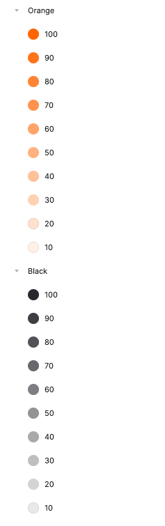
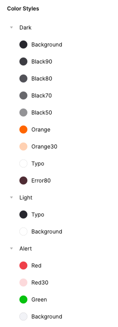

# Theme Tailor


## Generate style classes from figma


## Example

Styles in Figma





Styles in dart class when will be exported

### Colors
```dart
import 'package:flutter/material.dart';

class AppColors {
  const AppColors._();

  static const Color darkBackground = Color(0xFF27272E);
  static const Color darkBlack90 = Color(0xFF3D3D43);
  static const Color darkBlack80 = Color(0xFF525258);
  static const Color darkBlack70 = Color(0xFF68686D);
  static const Color darkBlack50 = Color(0xFF939396);
  static const Color darkOrange = Color(0xFFFF6500);
  static const Color darkOrange30 = Color(0xFFFFD1B3);
  static const Color darkTypo = Color(0xFFFFFFFF);
  static const Color darkError80 = Color(0xFF4F2C34);

  static const Color lightTypo = Color(0xFF27272E);
  static const Color lightBackground = Color(0xFFFFFFFF);

  static const Color orange10 = Color(0xFFFFF0E6);
  static const Color orange20 = Color(0xFFFFE0CC);
  static const Color orange30 = Color(0xFFFFD1B3);
  static const Color orange40 = Color(0xFFFFC199);
  static const Color orange50 = Color(0xFFFFB280);
  static const Color orange60 = Color(0xFFFFA366);
  static const Color orange70 = Color(0xFFFF934D);
  static const Color orange80 = Color(0xFFFF8433);
  static const Color orange90 = Color(0xFFFF741A);
  static const Color orange100 = Color(0xFFFF6500);

  static const Color black10 = Color(0xFFE9E9EA);
  static const Color black20 = Color(0xFFD4D4D5);
  static const Color black30 = Color(0xFFBEBEC0);
  static const Color black40 = Color(0xFFA9A9AB);
  static const Color black50 = Color(0xFF939396);
  static const Color black60 = Color(0xFF7D7D82);
  static const Color black70 = Color(0xFF68686D);
  static const Color black80 = Color(0xFF525258);
  static const Color black90 = Color(0xE6000000);
  static const Color black100 = Color(0xFF27272E);

  static const Color alertRed = Color(0xFFEF404A);
  static const Color alertRed30 = Color(0xFFFCD9DB);
  static const Color alertGreen = Color(0xFF06C20E);
  static const Color alertBackground = Color(0xFFF2F3F7);
}
```

### Typography

```dart
class AppTypography {
  const AppTypography._();

  static const TextStyle h1 = TextStyle(
    fontFamily: 'Montserrat',
    fontSize: 44,
    height: 1.2727272727272727,
    fontStyle: FontStyle.normal,
    letterSpacing: 0,
    fontWeight: FontWeight.w500,
  );

  static const TextStyle h2 = TextStyle(
    fontFamily: 'Montserrat',
    fontSize: 36,
    height: 1.5555555555555556,
    fontStyle: FontStyle.normal,
    letterSpacing: 0,
    fontWeight: FontWeight.w500,
  );

  static const TextStyle h3 = TextStyle(
    fontFamily: 'Montserrat',
    fontSize: 24,
    height: 1.3333333333333333,
    fontStyle: FontStyle.normal,
    letterSpacing: 0,
    fontWeight: FontWeight.w500,
  );

  static const TextStyle h4 = TextStyle(
    fontFamily: 'Montserrat',
    fontSize: 24,
    height: 1.3333333333333333,
    fontStyle: FontStyle.normal,
    letterSpacing: 0,
    fontWeight: FontWeight.w600,
  );

  static const TextStyle h5 = TextStyle(
    fontFamily: 'Montserrat',
    fontSize: 20,
    height: 1.6,
    fontStyle: FontStyle.normal,
    letterSpacing: 0,
    fontWeight: FontWeight.w500,
  );

  static const TextStyle h6 = TextStyle(
    fontFamily: 'Montserrat',
    fontSize: 20,
    height: 1.6,
    fontStyle: FontStyle.normal,
    letterSpacing: 0,
    fontWeight: FontWeight.w600,
  );

  static const TextStyle b1 = TextStyle(
    fontFamily: 'Montserrat',
    fontSize: 18,
    height: 1.7777777777777777,
    fontStyle: FontStyle.normal,
    letterSpacing: 0,
    fontWeight: FontWeight.w500,
  );

  static const TextStyle b2 = TextStyle(
    fontFamily: 'Montserrat',
    fontSize: 16,
    height: 2.0,
    fontStyle: FontStyle.normal,
    letterSpacing: 0,
    fontWeight: FontWeight.w500,
  );

  static const TextStyle b3 = TextStyle(
    fontFamily: 'Montserrat',
    fontSize: 14,
    height: 1.7142857142857142,
    fontStyle: FontStyle.normal,
    letterSpacing: 0,
    fontWeight: FontWeight.w500,
  );

  static const TextStyle b4 = TextStyle(
    fontFamily: 'Montserrat',
    fontSize: 16,
    height: 1.5,
    fontStyle: FontStyle.normal,
    letterSpacing: 0,
    fontWeight: FontWeight.w400,
  );

  static const TextStyle info = TextStyle(
    fontFamily: 'Montserrat',
    fontSize: 12,
    height: 1.3333333333333333,
    fontStyle: FontStyle.normal,
    letterSpacing: 0,
    fontWeight: FontWeight.w500,
  );

  static const TextStyle b5 = TextStyle(
    fontFamily: 'Montserrat',
    fontSize: 14,
    height: 1.7142857142857142,
    fontStyle: FontStyle.normal,
    letterSpacing: 0,
    fontWeight: FontWeight.w600,
  );

  static const TextStyle info2 = TextStyle(
    fontFamily: 'Montserrat',
    fontSize: 12,
    height: 1.3333333333333333,
    fontStyle: FontStyle.normal,
    letterSpacing: 0,
    fontWeight: FontWeight.w600,
  );

  static const TextStyle info3 = TextStyle(
    fontFamily: 'Montserrat',
    fontSize: 12,
    height: 1.3333333333333333,
    fontStyle: FontStyle.normal,
    letterSpacing: 0,
    fontWeight: FontWeight.w500,
  );
}
```

## How to do it

### 1. Prepare colors and font styles accordingly

You must create colors and fonts styles, you can learn how to do it from articale below

🔗 &nbsp;&nbsp;[(Click Me!) How create colors and fonts styles](https://help.figma.com/hc/en-us/articles/360038746534-Create-color-text-effect-and-layout-grid-styles)

</br>

### 2. Install and configure plugin for figma

🔗 &nbsp;&nbsp;[(Click Me!) Design Tokens](https://www.figma.com/community/plugin/888356646278934516/Design-Tokens)

When you have aready installed plugin go to `Plugins > Design Tokens > Settings` and you must changed some parameters.

* in `Filename` section change format from `.tokens.json` to `.json`.
* in `Name conversion` set type to `camelCase`.

Okey, now you can save changes and go to next step!

</br>

### 3. Export to json

- go to `Plugins > Design Tokens > Export Design Token File`
- in `Include types in export` section, check only `Colors` or `Font Styles` option. (important! only one option must be checked)
- click `Save & Export` and save file to `assets/styles` folder with name `colors.json` for colors or `typography.json` for font styles.

</br>

### 4. Generate the style classes

if you already have an exported color or font style file from figma, make sure it's in the folder `assets/styles` and use this command to generate the classes

```dart
  flutter pub run theme_tailor:main
```

| Args | Name     | Description                |
| :-------- | :------- | :------------------------- |
| `-h` | `help` | Showing all parameters |
| `-S` | `source-dir` | Folder containing styles files (defaults to "assets/styles") |
| `-T` | `source-file-typography` | File to use for typography style (defaults to "typography.json") |
| `-C` | `source-file-colors` | File to use for colors style (defaults to "colors.json") |
| `-O` | `output-dir` | Output folder stores for the generated file (defaults to "lib/presentation/style") |
| `-t` | `output-file-typography` | Output file name (defaults to "app_typography.dart") |
| `-c` | `output-file-colors` |  Output file name (defaults to "app_colors.dart") |

</br>

### 5. There it is, you can already use your styles!

```dart
  Container(
    color: AppColors.myCoolColor,
    child: Text(
      "YEAH!",
      style: AppTypography.myFontStyle
    ),
  ),
```